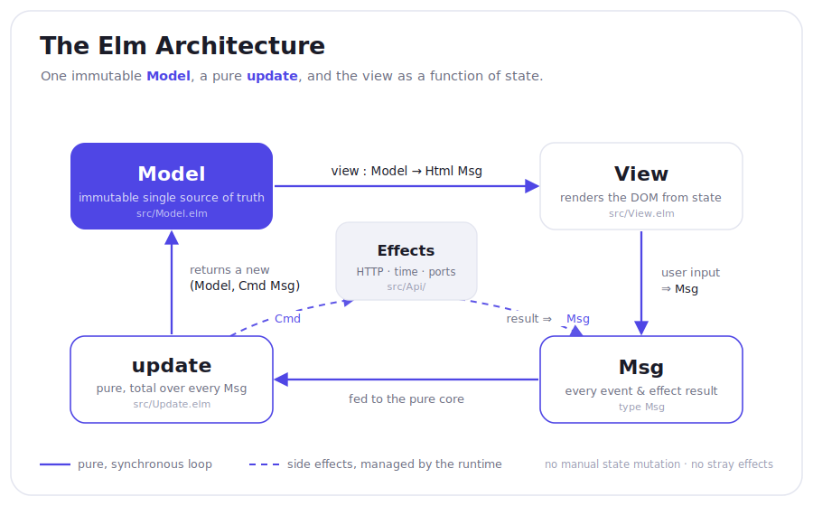

# booking_widget_elm

🇬🇧 [Read in English](./README.md)

Реализация виджета бронирования номера на [Elm](https://elm-lang.org) (The Elm
Architecture) — порт Vue 3-виджета из `../booking_widget`. Цель — измерить,
сколько **дыр в корректности** оригинала закрывает чистая TEA-архитектура с
сильной системой типов **структурно**, а не «не забыл проверить».

Тот же домен, те же детерминированные данные о занятости, тот же поток (даты →
гости → номер → проверка → подтверждение), та же i18n ru/en, переключение темы,
календарь и граница данных mock/http. Разница — только в том, *как смоделировано
состояние и как выражены переходы*.

Полный разбор соответствия «аудит → архитектура» — в
**[COMPARISON-RU.md](./COMPARISON-RU.md)** (12 из 13 дыр закрыты структурно, 1 — на
практике, 0 осталось открытыми).

## Архитектура



| Слой | Файл |
|------|------|
| Домен — чистые типы и правила, без `Browser`/`Html` | `src/Domain/` |
| Календарные даты на `justinmimbs/date` (без времени и TZ) | `src/Domain/Date.elm` |
| Непрозрачный `BookableDate` — прошлую дату не построить | `src/Domain/BookableDate.elm` |
| Model — сумм-типы, делающие плохие состояния невыразимыми | `src/Model.elm` |
| Умный конструктор `ValidBooking` + несущий его `Phase` | `src/Model.elm` |
| Чистый `update` — тотальный по `Msg`, защита по request-id | `src/Update.elm` |
| Порт данных + адаптеры (mock с задержкой / http с декодерами) | `src/Api.elm`, `src/Api/` |
| Типизированный канал ошибок (ADT `ApiError`) | `src/Api/Types.elm` |
| i18n — исчерпывающий матч по локали, ручное форматирование | `src/I18n.elm` |
| View — дерево `Html` из небольшого UI-kit | `src/View.elm`, `src/Ui.elm` |
| Флаги старта (`today`, тема, api url) + порты | `src/Main.elm`, `src/Ports.elm`, `src/main.ts` |
| Тесты — property-based по датам, домен, i18n, «истории» `update` | `tests/` |

## Команды

```bash
npm install
npm run dev        # дев-сервер Vite на http://localhost:5173
npm run build      # прод-сборка (elm make --optimize через vite-plugin-elm)
npm test           # elm-test: 77 тест (юнит / property / update-story)
npm run typecheck  # elm make --output=/dev/null
npm run lint       # elm-format --validate
```

По умолчанию виджет работает с мок-адаптером в памяти (имитация задержки сети,
состояния загрузки/ошибки). Установите `VITE_API_URL` (см. `.env.example`), чтобы
направить HTTP-адаптер с JSON-декодерами на реальный бэкенд — меняется только
одна строка.

## Property-based тестирование

Чистое календарное ядро `src/Domain/Date.elm` покрыто **fuzz**-тестами
[`elm-test`](https://github.com/elm-explorations/test) в
`tests/DomainDateTest.elm`: вместо подобранных примеров каждый тест проверяет
**инвариант** на сотнях случайно сгенерированных дат, а любой контрпример
автоматически сжимается до минимального. Проверяемые свойства:

- `eachDayInRange` — пусто ⟺ `to < from`, длина `= daysBetween + 1`, шаг в один
  день, каждая дата внутри `[from, to]`
- `stayNights` — заезд включительно / выезд исключительно (никогда день выезда)
- `nightsBetween` — не отрицательно; `nights(a, a+n) == max(n, 0)`
- `toIsoKey` — всегда `YYYY-MM-DD`, круговой через `Date.fromIsoString`, инъективен

Остальная часть набора прогоняет чистый `update` последовательностями сообщений и
проверяет получившуюся модель («истории»), плюс точечные тесты, фиксирующие ручное
форматирование валюты и дат.

## Лицензия

MIT
